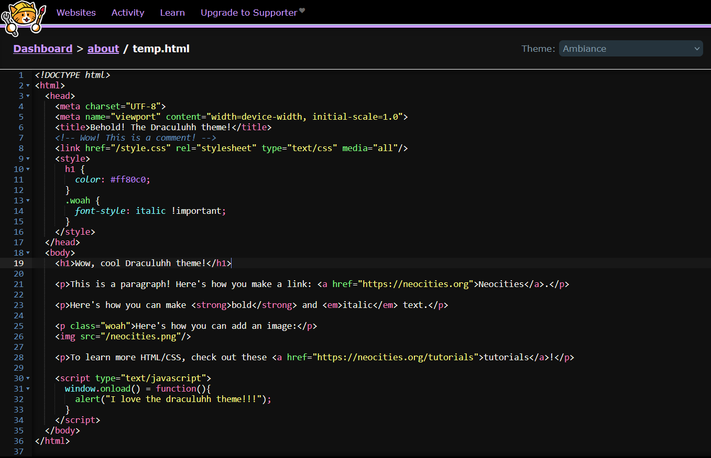

# Draculuhh for Neocities

A custom editor theme for Neocities (overrides the 'Ambiance' default theme).

## Installation and usage

* Ensure that you have installed the Stylus browser extension.
  * Don't have it? Firefox users can install it [here](https://addons.mozilla.org/en-GB/firefox/addon/styl-us/)!
* Install this theme from [userstyles.world](https://userstyles.world/api/style/19311.user.css).
* Select the 'Ambiance' theme when you next the Neocities code editor (Draculuhh will override that theme).

## Wait, where do I install it from again? I forgor

Go [here](https://userstyles.world/api/style/19311.user.css).

(and if you don't like clicking random links, here's the installation URL so you can just copy-paste it directly: `https://userstyles.world/api/style/19311.user.css`)

## Contributing

See an issue? Want to add something? Feel free to open an issue or make a pull request.

## License

Code released under the [MIT](./LICENSE) license.
